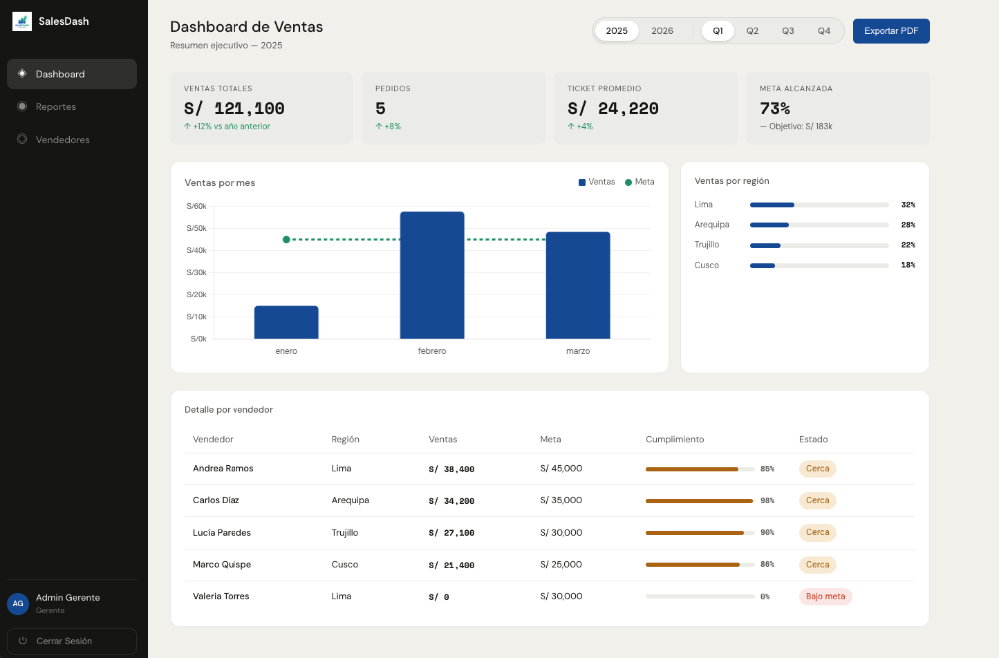

# Sales Dashboard

> **Advanced Multi-Year Enterprise Sales Intelligence.** 
> A sleek, high-performance dashboard designed to move from manual spreadsheets to real-time, role-aware data visualization.



## 🌟 Overview

**SalesDash** is a professional sales management platform built with a modern glassmorphic aesthetic. It provides regional managers and sales agents with the tools they need to track performance, manage goals, and analyze multi-year historical data (2025-2026) with precision.

---

## 🚀 Key Features

### 🔐 Role-Based Security (RBAC)
- **Manager Dashboard**: Comprehensive view of global KPIs, regional distribution, and top-tier performance metrics.
- **Seller Panel**: Personalized workspace for agents to track their own progress, register sales, and monitor quarterly goals.
- **JWT Protection**: Secure authentication layer protecting sensitive commercial data.

### 📅 Multi-Year Intelligence
- Switch dynamically between **2025** and **2026** sales cycles.
- Compare quarterly performance (Q1-Q4) with historical data.
- State-persisted year filtering via Vuex.

### 📊 Professional Analytics
- **Live Performance Trend**: Synchronized bar and line charts comparing Actual Sales vs. Goals.
- **Regional Distribution**: Insightful doughnut charts highlighting market dominance.
- **Exporter**: Built-in functionality to generate performance reports (PDF coming soon).

---

## 💻 Tech Stack

### Frontend
- **Framework**: [Vue.js 2](https://v2.vuejs.org/) (SFC Pattern)
- **State Management**: [Vuex](https://vuex.vuejs.org/)
- **Routing**: [Vue Router](https://v3.router.vuejs.org/)
- **Visualizations**: [Chart.js](https://www.chartjs.org/)
- **Styling**: [SASS/SCSS](https://sass-lang.com/) with Glassmorphic Design Tokens.

### Backend
- **Core**: [Node.js](https://nodejs.org/) & [Express.js](https://expressjs.com/)
- **Auth**: [JSON Web Tokens (JWT)](https://jwt.io/)
- **Database**: In-memory optimized store with LocalStorage persistence.

---

## 🛠️ Installation & Setup

### 1. Prerequisites
- [Node.js](https://nodejs.org/) (v14+ recommended)
- npm (v6+)

### 2. Clone the Repository
```bash
git clone https://github.com/luuzuriaga/sales-dashboard.git
cd sales-dashboard
```

### 3. Backend Setup
```bash
cd backend
npm install
npm run dev
```
*The API will be available at `http://localhost:3000`*

#### Configuración de variables de entorno:
1. Copia el archivo de ejemplo:
   ```bash
   cp .env.example .env
   ```
2. Abre `.env` y configura tu `SECRET_KEY` y otras variables si es necesario.

### 4. Frontend Setup
Open a new terminal in the project root:
```bash
cd frontend
npm install
npm run serve
```
*The Dashboard will be served at `http://localhost:8080`*

#### Configuración de variables de entorno:
1. Crea/copia el archivo `.env` en la carpeta `frontend/`:
   ```bash
   cp .env.example .env
   ```
2. Asegúrate de que `VUE_APP_API_URL` apunte a la dirección de tu backend (por defecto `http://localhost:3000`).

---

## 📂 Project Structure

```text
├── backend/            # Express.js API & Authentication logic
├── frontend/           # Vue.js Frontend
│   ├── public/         # Static assets (Favicons, index.html)
│   ├── src/
│   │   ├── assets/     # Design system & Branding (Logos, Banner)
│   │   ├── components/ # Reusable Vue components (Charts, KPIs)
│   │   ├── store/      # Vuex Global State (Filtering, User Auth)
│   │   ├── views/      # Principal views (Manager vs Seller)
│   │   └── styles/     # SASS variables & Global styles
│   ├── .env            # Frontend environment variables
│   └── vue.config.js   # Vue configuration
└── vercel.json         # Deployment configuration
```

---

## 📝 License

Distributed under the MIT License. See `LICENSE` for more information.

---

## 🤝 Contact

**Lucero Uzuriaga**  
Project Link: [https://github.com/luuzuriaga/sales-dashboard](https://github.com/luuzuriaga/sales-dashboard)


